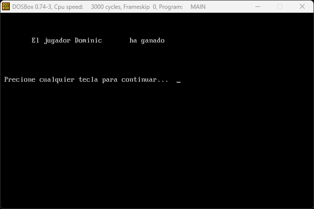

# LABORATORIO Arquitectura de Computadores y Ensambladores 1 🖥️
## Manual Tecnico : Juego de Ajedrez en Ensamblador 📚
### SEGUNDO SEMESTRE 2023 📅

```js
Universidad San Carlos de Guatemala 🎓
Programador: Dominic Juan pablo Ruano Perez 🧑‍💻
Carne: 202200075 🆔
Profesor: Ing. Otto Escobar
Sección A: Jorge Mario Castañeda Cragua
```
---
## Descripción del Proyecto📋
El objetivo de este proyecto es desarrollar un juego de ajedrez en lenguaje ensamblador, con el propósito de aplicar y demostrar los conocimientos adquiridos en el curso de Arquitectura de Computadores y Ensambladores 1. El juego servirá como una herramienta para evaluar distintos aspectos del procesador, tales como el manejo de registros, el uso de banderas y la implementación de interrupciones.

Para llevar a cabo este proyecto, se utilizará DOSBox, un emulador de x86 que permite ejecutar programas antiguos que fueron diseñados para los sistemas operativos MS-DOS. DOSBox proporciona un entorno controlado y seguro para probar y depurar el juego de ajedrez en ensamblador, sin los riesgos asociados con la ejecución de código de bajo nivel directamente en sistemas operativos modernos.

## Objetivos 🎯

### General

- **Aplicar los conocimientos adquiridos en el curso sobre el lenguaje ensamblador**: El proyecto tiene como objetivo principal la aplicación práctica de los conceptos teóricos aprendidos en el curso, enfocándose en el desarrollo de un juego de ajedrez en lenguaje ensamblador. Esto permitirá a los estudiantes demostrar su capacidad para trabajar con este lenguaje de bajo nivel y comprender su importancia en la programación de sistemas.

### Específicos

- **Conocer el funcionamiento de las interrupciones**: Los estudiantes aprenderán a manejar interrupciones en el lenguaje ensamblador, lo que es fundamental para el control de eventos externos y la gestión de recursos en sistemas operativos y aplicaciones en tiempo real.
- **Comprender el uso de la memoria en los programas informáticos**: A través del desarrollo del juego, los estudiantes profundizarán en su comprensión de cómo se utiliza la memoria en la programación, incluyendo la gestión de variables, el almacenamiento de datos y la manipulación de direcciones de memoria.
- **Consolidar los conocimientos de escritura/lectura de archivos**: El proyecto requerirá que los estudiantes apliquen sus habilidades en la manipulación de archivos, lo cual es esencial para la persistencia de datos, como los puntajes y reportes generados por el juego.
- **Poner en práctica los conocimientos de operaciones aritméticas básicas a bajo nivel**: El juego de ajedrez brindará una oportunidad para que los estudiantes apliquen operaciones aritméticas básicas en el contexto de un programa ensamblador, lo que es crucial para el desarrollo de algoritmos eficientes en este lenguaje.
- **Desarrollar la capacidad de resolver un problema a nivel de lenguaje ensamblador**: Al enfrentarse al desafío de crear un juego de ajedrez en ensamblador, los estudiantes pondrán a prueba su capacidad para analizar y resolver problemas utilizando un enfoque de programación de bajo nivel.

Estos objetivos buscan no solo reforzar los conocimientos técnicos de los estudiantes, sino también fomentar el desarrollo de habilidades analíticas y de resolución de problemas que serán valiosas en su futura carrera profesional.

---
## Herramientas Principales a Utilizar 🛠️

Las siguientes herramientas y programas son esenciales para el desarrollo, prueba y ejecución del juego de ajedrez en ensamblador:

- **Microsoft Macro Assembler (MASM) 6.11:** 
  - Utilizado para ensamblar el código fuente en lenguaje ensamblador a código máquina.
  - Permite la creación de programas a nivel de sistema operativo y hardware.
  
- **DOSBox:**
  - Un emulador de DOS que permite ejecutar programas ensamblados con MASM en un entorno seguro y controlado.
  - Facilita la depuración y prueba de aplicaciones de ensamblador en sistemas operativos modernos.

- **EMU8086**:
  - Es un simulador de microprocesador y ensamblador para la familia de microprocesadores 8086.
  - Ideal para la enseñanza y práctica del lenguaje ensamblador, proporciona un entorno de ensamblaje y simulación completo.

- **Visual Studio Code:**
  - Editor de código fuente que proporciona un entorno de desarrollo integrado para escribir y depurar código.
  - Compatible con extensiones para lenguaje ensamblador y herramientas de control de versiones como Git.

- **Git:**
  - Sistema de control de versiones utilizado para rastrear cambios en el código fuente durante el desarrollo del juego.
  - Permite la colaboración y gestión de código entre múltiples desarrolladores.

- **GitHub:**
  - Plataforma de alojamiento de código para control de versiones y colaboración.
  - Utilizada para almacenar el repositorio del proyecto y facilitar la entrega y revisión del mismo.

Cada herramienta ha sido seleccionada para maximizar la eficiencia y efectividad en cada etapa del desarrollo del juego, desde la escritura del código hasta su ejecución y depuración.

---

## Enlaces de Utilidad  🔗

#### instalacion masm y dosbox
- Descripción: en este video se muestran los pasos a seguir para instalar tanto dosbox como masm6.11
- [DOSBox Official Site](https://www.youtube.com/watch?v=q6Z6p9RD7yw)


#### DOSBox
- Descripción: DOSBox es un emulador de x86 con DOS que permite ejecutar programas de ensamblador y otros software antiguo en plataformas modernas.
- [DOSBox Official Site](https://www.dosbox.com/)

#### Visual Studio Code
- Descripción: Visual Studio Code es un editor de código fuente desarrollado por Microsoft que es libre y de código abierto.
- [Visual Studio Code Official Download](https://code.visualstudio.com/)

#### Git
- Descripción: Git es un sistema de control de versiones distribuido, diseñado para manejar desde proyectos pequeños a muy grandes con rapidez y eficiencia.
- [Git Official Site](https://git-scm.com/)

#### GitHub
- Descripción: GitHub es una plataforma de desarrollo colaborativo para alojar proyectos utilizando el sistema de control de versiones Git.
- [GitHub Official Site](https://github.com/)

#### EMU8086
- Descripción: EMU8086 es un microprocesador Intel 8086 con emulador de ensamblador integrado, ideal para estudiantes que aprenden CPU y codificación en lenguaje de máquina.
- [EMU8086 Official Site](http://www.emu8086.com/)

___
## Errores que se manejan

>*  Ingresar un valor fuera del rango
    al ingresar un numero distinto a los validos simplemente el programa no lo recibira y seguira esperando por una opcion valida.

---

>*   Ingresar mal la fila
    al ingresar un valor no valido para la fila se pedira de nuevo la misma.

---

>*   Ingresar mal la columna
    al ingresar un valor no valido para la columna se pedir de nuevo la misma.

---

>*   Ingresar una casilla no valida
    Si la casilla ingresada no tiene una pieza o la pieza no es del jugador en turno mostrara un error.


---
## Funciones dentro del codigo

>*   Menu principal
    Muestra el menu principal del proyecto donde se puede observar todas las opciones en las que este consiste.

---

>*   Ingresar nombre
    Si el usuario selecciona la opcion 1 en el menu principal entrara en esta vista donde se le pedira que ingrese su nombre con un maximo de 14 caracteres de lo contrario se dejaran de recibir caracteres.

---

>*   Opcion si o no
    en esta vista como se muestra se le pregunta al usuario si esta satisfecho con el nombre ingresado, ingresando y para decir que si, o de lo contraro n para no, TENER EN CUENTA QUE TODAS ESTAS DEDEN ESTAR EN MAYUSCULA

---

>*   Tablero de juego
    en esta parte podemos observar todos los elementos que se muestran en el tablero de juego, como pueden ser los el encabezado que cuenta con un parte de VZ mostrando el nombre del jugador y de la Ia, luego el turno actual y para terminar con el encabezado se muestra los segundos que han pasado.
    luego podemos observar el estado actual del tablero.
    y para finalizar nos mostrara un mensaje apra ingrasar fila y consecutivamente para ingresar columna.

---

>*   Cambio en Tablero de juego
    aqui podemos observar que es el turno de IA, el tiempo ha aumentado y podemos ver que se realizo el primer movimiento del juegador.

---

>*   Pantalla de Fin
    se puede ver como se muestra que el usuario ha ganado, para aceeder a esta ventana se debe ingresar w para indicarque el jugador gano, y W para indicar que IA ha ganado.
    los resultado de esto se guardaran en DB

---

>*   Mostrar puntajes
    esta pestaña se muestra al ingresar 2 en el menu principal, y nos mostrara el historico de los ganadores guardados en db.

---

>*   Imprimir Reporte
    esta pestaña se muestra al ingresar 3 en el menu principal y simplemente nos indica que se ha generado un archivo html con el historico de los ganadores.

---

>*   Salir
    al precionar 4 el programa saldra, o terminara su ejecucion, y en este caso mos dejara en la consola de dosbox, ingresando EXIT podremos cerrar la ventana.

---

>*   Reoprte html
    aqui veremos el html generado por la 3ra opcion del menu prncipal, donde verenos los datos del estudiente, seccion, nombre del curso, fecha y hora actual y para terminar el historico de los ganadores guardados en la DB

---
## Pasos a seguir para ejecutar.


>*   Paso 1
    estando en la carpeta navegando con CD.
    denemos ingresar el comando aqui mostrado.

---

>*   paso 1.1
    si vemos que nos muestra un mensaje igual a este todo salio correctamente, y denemos proseguir con los demans comando de lo contrario mostrara la linea de macro en la cual surgio el error, y denemos corregir.

---

>*   Paso 2
    una vez terminado el paso 1 debemos ingresar este comando pero tomar en cuenta que esta vez debemos usar la terminacion .obj en lugar de la .asm que se uso para el paso anterior.

---

>*   Paso 2.1
    una vez nos muestre este mensaje debemos ver que en todas las lineas donde termina en : debemos pulsar intro para seguir un total de 4 veces esto se hace para deja por defecto todos los atributos.

---

>*   Paso 2.2
    una vez echo eso podemos observar que nos saco a la consola y mos mostro este ultimo mensjae.

---

>*   Paso 3
    una vez realizados correctamente todos los pasos anteriores solo queda ejecutar el .exe, el cual se debe llamar main.asm ya que dejamos todos los valores por defecto en el paso 2.1.

---