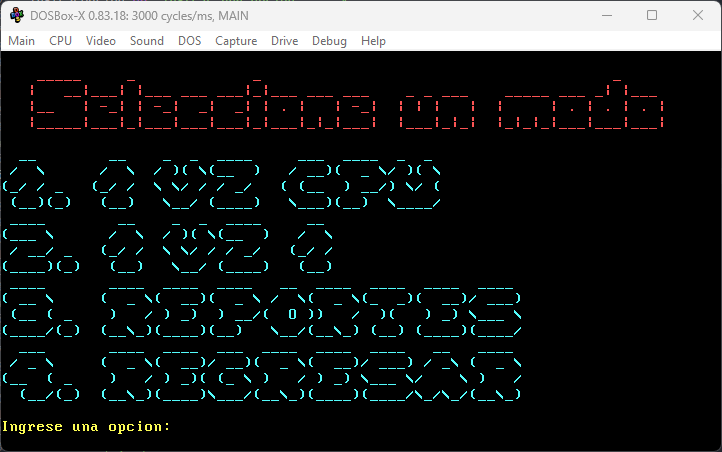
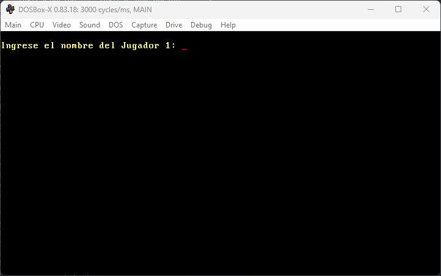
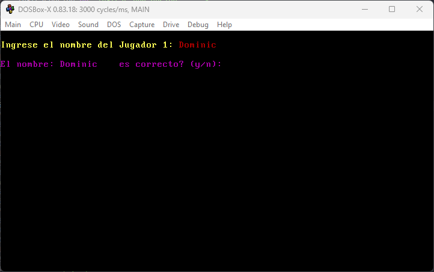
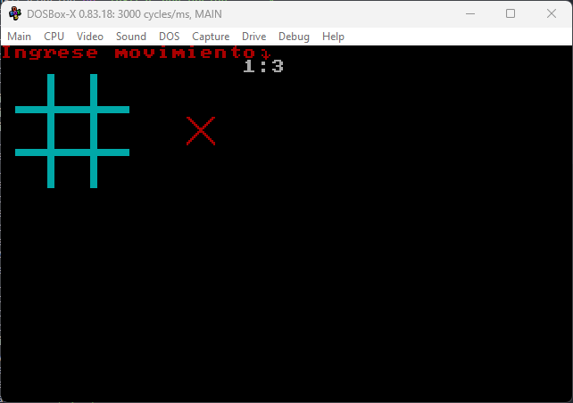
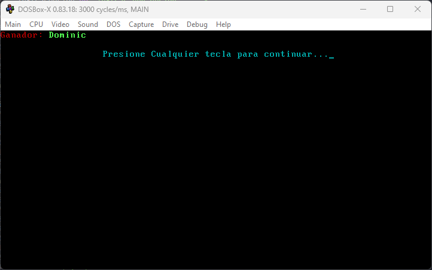
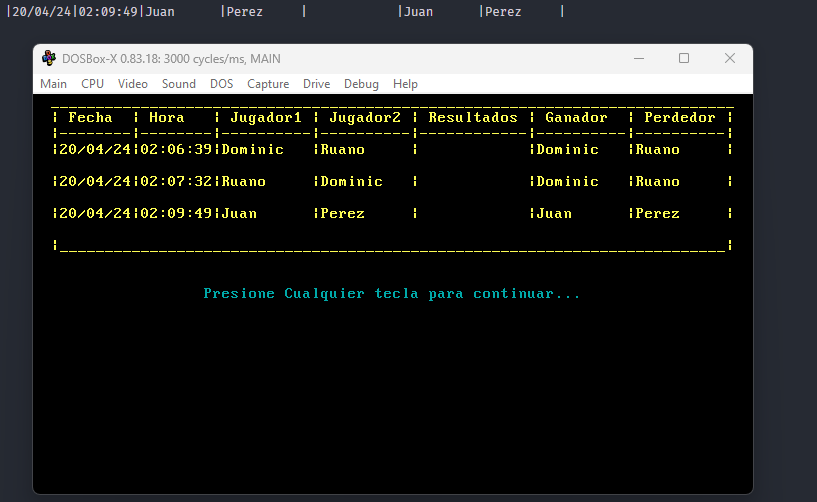

# LABORATORIO Arquitectura de Computadores y Ensambladores 1 🖥️
## Manual de usuario : Juego de Totito y animaciones ascii en Ensamblador 📚
### SEGUNDO SEMESTRE 2023 📅

```js
Universidad San Carlos de Guatemala 🎓
Programador: Dominic Juan pablo Ruano Perez 🧑‍💻
Carne: 202200075 🆔
Profesor: Ing. Otto Escobar
Sección A: Jorge Mario Castañeda Cragua
```
---
## Descripción del Proyecto📋
El proyecto es un desafío de programación en ensamblador que involucra la creación de un menú interactivo para seleccionar entre jugar "Totito" o visualizar animaciones "ascii art". La implementación requiere el uso avanzado de interrupciones del sistema, manejo de la memoria de video, y el dibujo en modo gráfico para una interfaz de usuario amigable y atractiva.

el desarrollo de un programa en lenguaje ensamblador que ofrece dos actividades principales: jugar al juego de "Totito" o realizar una animación con una imagen "ascii art" utilizando el modo video y las interrupciones 10h. El programa comenzará con un menú principal que permite al usuario elegir entre estas opciones y cada opción desencadena una serie de funcionalidades detalladas y requisitos específicos, incluyendo la gestión de errores y la generación de reportes .

## Objetivos 🎯

### General

- Aprender y aplicar el uso de mnemotécnicos en MASM y la utilización de interrupciones para desarrollar aplicaciones interactivas.
- Entender y manipular el modo video en ensamblador para crear gráficos y animaciones, así como manejar entradas de usuario a través del teclado.
- Resolver problemas de programación utilizando instrucciones de bajo nivel y desarrollar un manejo eficiente de los recursos del sistema .

### Específicos

- Desarrollar habilidades en lenguaje ensamblador, enfocándose en el manejo de interrupciones y el modo video para crear una interfaz de usuario y funcionalidades gráficas para juegos y animaciones.

---
## Herramientas Principales a Utilizar 🛠️

Las siguientes herramientas y programas son esenciales para el desarrollo, prueba y ejecución del juego de ajedrez en ensamblador:

- **Microsoft Macro Assembler (MASM) 6.11:** 
  - Utilizado para ensamblar el código fuente en lenguaje ensamblador a código máquina.
  - Permite la creación de programas a nivel de sistema operativo y hardware.
  
- **DOSBox:**
  - Un emulador de DOS que permite ejecutar programas ensamblados con MASM en un entorno seguro y controlado.
  - Facilita la depuración y prueba de aplicaciones de ensamblador en sistemas operativos modernos.

- **EMU8086**:
  - Es un simulador de microprocesador y ensamblador para la familia de microprocesadores 8086.
  - Ideal para la enseñanza y práctica del lenguaje ensamblador, proporciona un entorno de ensamblaje y simulación completo.

- **Visual Studio Code:**
  - Editor de código fuente que proporciona un entorno de desarrollo integrado para escribir y depurar código.
  - Compatible con extensiones para lenguaje ensamblador y herramientas de control de versiones como Git.

- **Git:**
  - Sistema de control de versiones utilizado para rastrear cambios en el código fuente durante el desarrollo del juego.
  - Permite la colaboración y gestión de código entre múltiples desarrolladores.

- **GitHub:**
  - Plataforma de alojamiento de código para control de versiones y colaboración.
  - Utilizada para almacenar el repositorio del proyecto y facilitar la entrega y revisión del mismo.

Cada herramienta ha sido seleccionada para maximizar la eficiencia y efectividad en cada etapa del desarrollo del juego, desde la escritura del código hasta su ejecución y depuración.

---

## Enlaces de Utilidad  🔗

#### DOSBox
- Descripción: DOSBox es un emulador de x86 con DOS que permite ejecutar programas de ensamblador y otros software antiguo en plataformas modernas.
- [DOSBox Official Site](https://www.dosbox.com/)

#### Visual Studio Code
- Descripción: Visual Studio Code es un editor de código fuente desarrollado por Microsoft que es libre y de código abierto.
- [Visual Studio Code Official Download](https://code.visualstudio.com/)

#### Git
- Descripción: Git es un sistema de control de versiones distribuido, diseñado para manejar desde proyectos pequeños a muy grandes con rapidez y eficiencia.
- [Git Official Site](https://git-scm.com/)

#### GitHub
- Descripción: GitHub es una plataforma de desarrollo colaborativo para alojar proyectos utilizando el sistema de control de versiones Git.
- [GitHub Official Site](https://github.com/)

#### EMU8086
- Descripción: EMU8086 es un microprocesador Intel 8086 con emulador de ensamblador integrado, ideal para estudiantes que aprenden CPU y codificación en lenguaje de máquina.
- [EMU8086 Official Site](http://www.emu8086.com/)

___
## Funciones dentro del codigo

>*   Menu principal
    Muestra el menu principal del proyecto donde se puede observar todas las opciones en las que este consiste.
    *La consola en todo momento esta esperando una entrada entre 1 - 4 de recibir algun otro tipo de valor simplemento se ignorar *

---

>*   Seleccion de modo de juego
    en este sub menu la consola esta esperando a que se ingrese un valor entre 1 - 4 se no ser asi no se monstrara nada o consecuentemente se ira a donde se seleccione si esta en el rango.

---

>*   Ingresar nombre
  esta pantalla se muestra multiples veces en toda la ejecucion del juego, en el modo de 1 vz CPU se debe ingresar el nombre del jugador 1 y por defecto el nombre del jugador 2 sera CPU, en cambio en el modo de 1 vz 1 se debera ingresar el nombre tanto del jugador 1 como del jugador 2.

---

>*   confirmacion al ingresar nombre
  en esta pantalla luego de ingresar el nombre nos pedira que ingresemos si el nombre esta correctamente ingresado y/o guardado en la memoria del programa. debemos ingresar y para si y n para no.

---

>*   Modo de juego Totito
    para el modo de juego del totito podemos observar que tenemos una flecha luego de la grase ingrese movimiento, al presionar una tecla de estar en el rango 1 - 3 y en el segundo char ser un : se mostrara en pantalla y se ingresara en memoria. tambien podemos observar el turno, el cual se muestra con el simbolo que se encuentra a la derecha del tablero.

---

>*   Ganador
    La pantalla de ganador, se muestra al momento de que un jugador gane la partida, esta guardara en una DB la informacion en formato tabla para que esta pueda ser mostrada en el menu de reportes. se muestra en color verde el jugador que ha ganado la partida o en caso de empate lo indica y al ingresar una tecla se regresara al menu para seleccionar un modo de juego.

---

>*   Mostrar Reportes
    esta pantalla leera el archivo de texto DB que contiene el historial de las partidas ganadas, podemos observar que genera la fecha y la hora actuales , muestra el ganador y el perdedor, tambien muestra en caso de empate.

---

>*   Informacion personal
    este menu es donde se encuentra toda la informacion personal del estudiante que creo el sistema. como se indica en el enunciado esta pantalla se encuentra estilizada al igual que todas las demas con arte ascii

---

___
##  posibles errores que se pueden presentar en la ejecucion del programa y solucion a estos

>*   Ingresar mal un movimiento
    si se ingresa mal un movimiento la solucion es terminar el movimiento intentando caer sobre una celda la cual ya este ocupada.
    esto se debe a que el sistema no tiene la capacidad de interrumpir el ingreso de un movimiento a la mitad del mismo y si se ingresa una celda la cual ya se encuentra ocupada el sistema si tiene la capacidad de ignorar ese movimiento, por lo que es lo mas aconsejable para realizar la cancelacion de un movimiento.
---

>*   Reoprte sin color
    debido a las limitaciones del lenguaje ensamblador al momento de leer los caracteres se limita a una variable tipo word y no esa capaz de pintar cuando el reporte tiene alrededor de 6 registros, sin embargo esto no comprende ningun problema para seguir ejecutando ccualquier funcion del sistema.
---