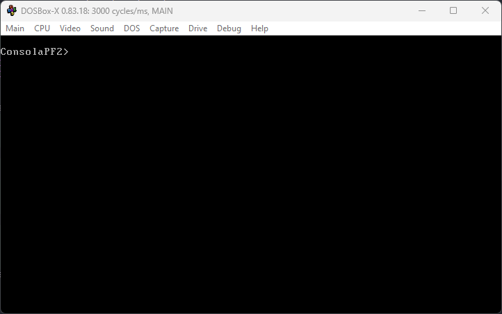
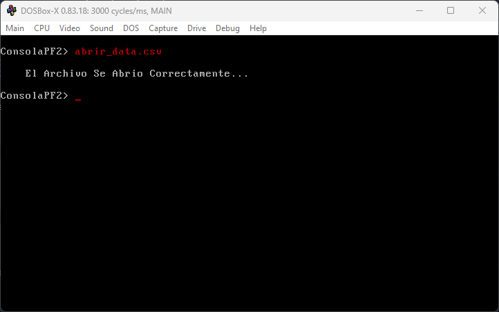
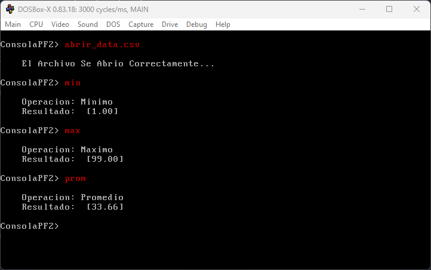
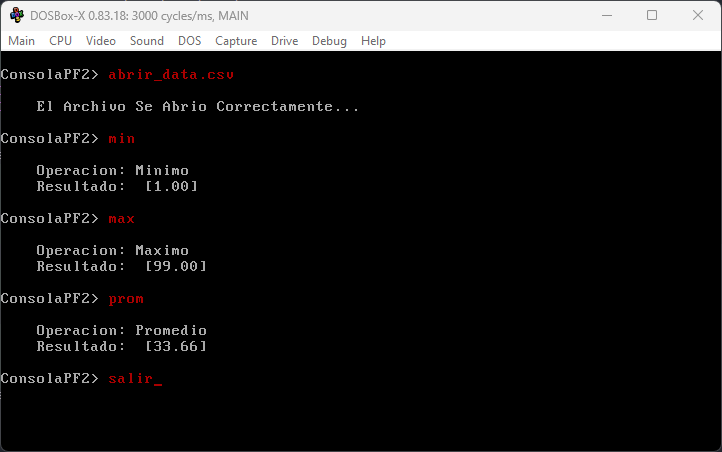
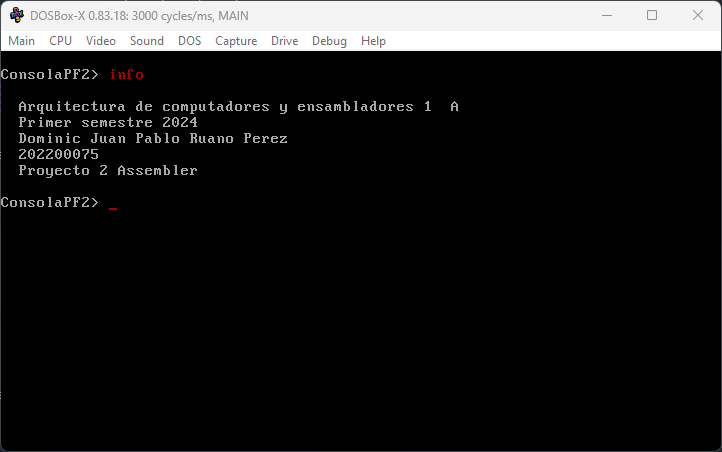
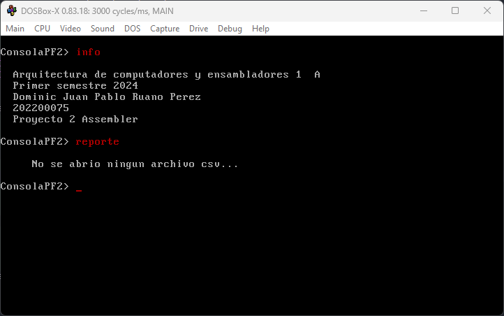
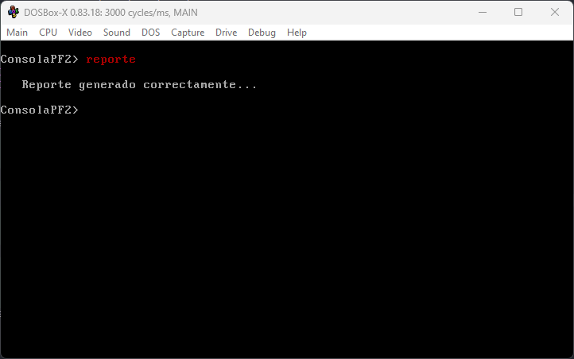
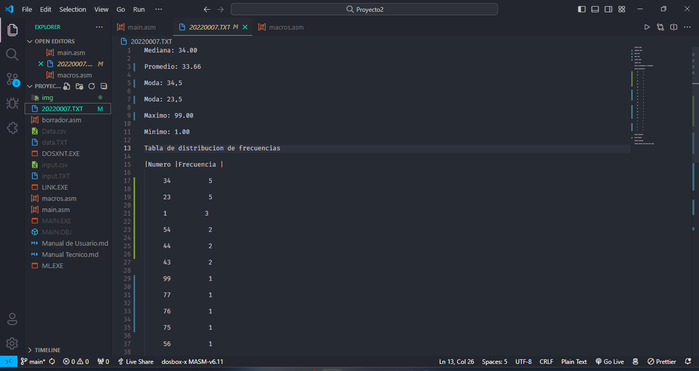
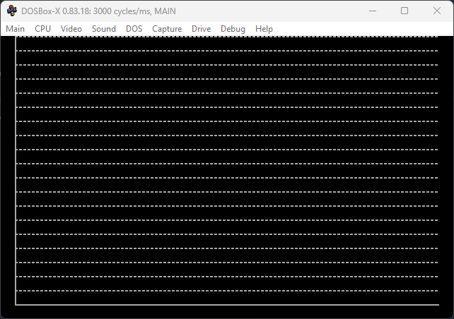

# LABORATORIO Arquitectura de Computadores y Ensambladores 1 🖥️
## Manual de usuario : Proyecto 2 📚
### SEGUNDO SEMESTRE 2023 📅

```js
Universidad San Carlos de Guatemala 🎓
Programador: Dominic Juan pablo Ruano Perez 🧑‍💻
Carne: 202200075 🆔
Profesor: Ing. Otto Escobar
Sección A: Jorge Mario Castañeda Cragua
```
---
## Descripción del Proyecto📋
Este proyecto tiene como objetivo desarrollar una plataforma de análisis estadístico para la empresa Wolfram, especializada en datos matemáticos y estadísticos. La plataforma permitirá ejecutar y visualizar diversas métricas estadísticas, facilitando la comprensión y el análisis de datos a través de gráficos y resultados numéricos. Los datos serán cargados desde un archivo CSV, lo que permite un manejo eficiente y flexible de grandes volúmenes de información.

## Objetivos 🎯

### General
- Desarrollar una plataforma robusta de análisis estadístico que permita la carga, procesamiento, visualización y análisis de datos mediante el uso del lenguaje ensamblador, aprovechando las capacidades de manipulación directa de hardware y optimización de recursos que este lenguaje ofrece.

### Específicos
- Implementar la carga de datos desde archivos CSV para facilitar la entrada y manipulación de grandes conjuntos de datos, permitiendo así realizar análisis estadísticos sobre variadas muestras de datos.
- Desarrollar funciones estadísticas que permitan calcular medidas de tendencia central y dispersión como el promedio, mediana, moda, máximo y mínimo, proporcionando herramientas básicas para el análisis estadístico.
- Crear visualizaciones gráficas mediante gráficos de barras y líneas que permitan interpretar de manera más sencilla los resultados estadísticos, facilitando la comprensión de los datos y ayudando en la toma de decisiones basada en los análisis realizados.
- Generar reportes automatizados que resuman los cálculos estadísticos y distribuciones de frecuencia en un formato de texto plano, ofreciendo una forma sencilla y directa de revisar y archivar los resultados obtenidos.
- Optimizar la interfaz de usuario mediante la programación en ensamblador para gestionar los comandos y las salidas de manera eficiente, garantizando una experiencia de usuario fluida y efectiva.
- Aplicar prácticas de programación de bajo nivel para manejar el modo de video y otras funcionalidades del sistema operativo, asegurando que la aplicación aproveche al máximo las capacidades del hardware disponible.


---
## Herramientas Principales a Utilizar 🛠️

Las siguientes herramientas y programas son esenciales para el desarrollo, prueba y ejecución del juego de ajedrez en ensamblador:

- **Microsoft Macro Assembler (MASM) 6.11:** 
  - Utilizado para ensamblar el código fuente en lenguaje ensamblador a código máquina.
  - Permite la creación de programas a nivel de sistema operativo y hardware.
  
- **DOSBox:**
  - Un emulador de DOS que permite ejecutar programas ensamblados con MASM en un entorno seguro y controlado.
  - Facilita la depuración y prueba de aplicaciones de ensamblador en sistemas operativos modernos.

- **EMU8086**:
  - Es un simulador de microprocesador y ensamblador para la familia de microprocesadores 8086.
  - Ideal para la enseñanza y práctica del lenguaje ensamblador, proporciona un entorno de ensamblaje y simulación completo.

- **Visual Studio Code:**
  - Editor de código fuente que proporciona un entorno de desarrollo integrado para escribir y depurar código.
  - Compatible con extensiones para lenguaje ensamblador y herramientas de control de versiones como Git.

- **Git:**
  - Sistema de control de versiones utilizado para rastrear cambios en el código fuente durante el desarrollo del juego.
  - Permite la colaboración y gestión de código entre múltiples desarrolladores.

- **GitHub:**
  - Plataforma de alojamiento de código para control de versiones y colaboración.
  - Utilizada para almacenar el repositorio del proyecto y facilitar la entrega y revisión del mismo.

Cada herramienta ha sido seleccionada para maximizar la eficiencia y efectividad en cada etapa del desarrollo del juego, desde la escritura del código hasta su ejecución y depuración.

---

## Enlaces de Utilidad  🔗

#### DOSBox
- Descripción: DOSBox es un emulador de x86 con DOS que permite ejecutar programas de ensamblador y otros software antiguo en plataformas modernas.
- [DOSBox Official Site](https://www.dosbox.com/)

#### Visual Studio Code
- Descripción: Visual Studio Code es un editor de código fuente desarrollado por Microsoft que es libre y de código abierto.
- [Visual Studio Code Official Download](https://code.visualstudio.com/)

#### Git
- Descripción: Git es un sistema de control de versiones distribuido, diseñado para manejar desde proyectos pequeños a muy grandes con rapidez y eficiencia.
- [Git Official Site](https://git-scm.com/)

#### GitHub
- Descripción: GitHub es una plataforma de desarrollo colaborativo para alojar proyectos utilizando el sistema de control de versiones Git.
- [GitHub Official Site](https://github.com/)

#### EMU8086
- Descripción: EMU8086 es un microprocesador Intel 8086 con emulador de ensamblador integrado, ideal para estudiantes que aprenden CPU y codificación en lenguaje de máquina.
- [EMU8086 Official Site](http://www.emu8086.com/)

___
## Funciones dentro del codigo

# Comandos Disponibles
- abrir_nombreArchivo.csv: Carga los datos desde el archivo CSV especificado.
- prom: Calcula y muestra el promedio de los datos.
- mediana: Calcula y muestra la mediana de los datos.
- moda: Calcula y muestra la moda de los datos.
- max: Muestra el valor máximo de los datos.
- min: Muestra el valor mínimo de los datos.
- contador: Muestra la cantidad de datos cargados.
- graf_barra_asc: Muestra un gráfico de barras de la frecuencia de datos en orden ascendente.
- graf_barra_desc: Muestra un gráfico de barras de la frecuencia de datos en orden descendente.
- graf_linea: Muestra un gráfico de línea de la frecuencia de datos.
- limpiar: Limpia la consola y espera nuevos comandos.
- reporte: Genera un reporte con los resultados estadísticos.
- info: Muestra información del curso, el estudiante y el proyecto.
- salir: Cierra el programa.
# Ejemplos de Uso
- Cargar Datos: abrir_datos.csv
- Calcular Promedio: prom
- Visualizar Gráfico de Barras Ascendente: graf_barra_asc

# Funcionalidades
- Carga de Datos: Los datos se cargarán a través de un archivo CSV, sin límite en el número de entradas y con valores en el rango de 0 a 99.
- Operaciones Estadísticas Básicas: Se incluyen funciones para calcular el promedio, mediana, moda, valor máximo y mínimo de los datos cargados.
- Visualización Gráfica: La plataforma ofrece gráficos de barras (ascendentes y descendentes) y gráficos de línea para visualizar la frecuencia de los datos de manera clara y estética.
- Generación de Reportes: Capacidad para generar un reporte en texto plano que resume las estadísticas calculadas y la distribución de frecuencias de los datos.

>*   consola
  aqui podemos observar como la consola nos pide que se ingrse un comentario de los que estan disponibles


---

>*   Leer un archivo .csv
  aqui podemos ver como debemos ingresar el nombre del archivo a leer y nos indicara si se ha leido correctamente el mismo.

---

>*   Ejemplo de algunos comandos
  podemos ver como se debe ingresar los comando como puede ser min, max o prom

---

>*   Comando salir 
  este comando cerrara la consola terminando el programa.

---

>*   Info
  mostrara la informacion del estudiante que realizo este proyecto.

---

>*   ejecutar un comando si no se cargo csv
  de esta forma se muestra cuando se ingresa un comando sin haber antes leido un archivo.

---

>*   Mostrar Reportes
  esto generara un archivo .txt con la informacion leida del csv


---

>*   Generacion del txt
  de esta forma se mostrara el txt

---

>*   Graficas
  funcion incompleta del proyecto se muestra como estas simplemente genera las bases pero no muestra informacion de las graficas.

---
